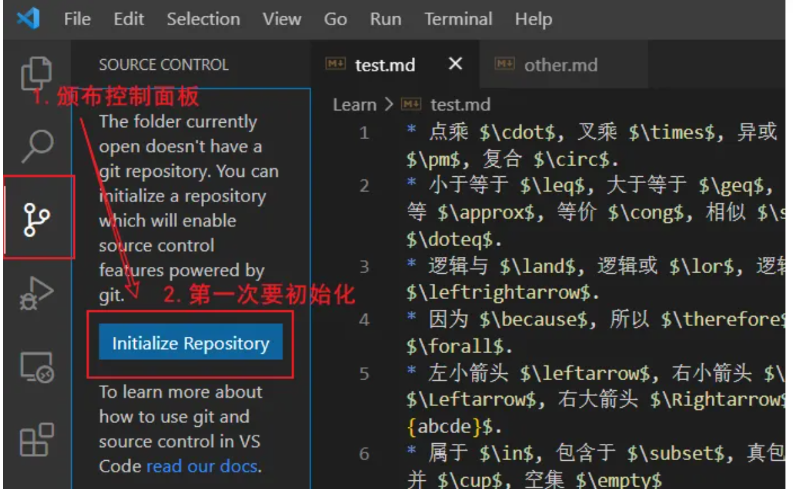
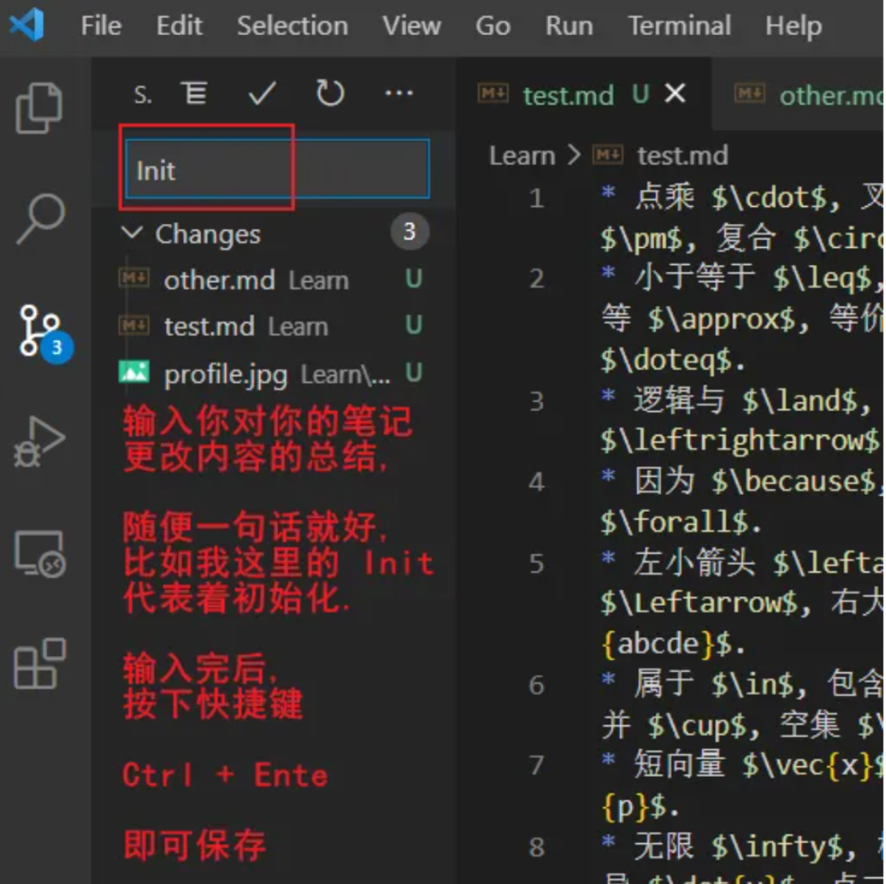

## 1. 两者的区别
1) git：版本控制软件；
2) github：开源网站


## 2. VsCode代码上传至Github
1）新建项目文件和远程仓库：同名
2）Vscode内打开项目文件，进行初始化


3）完成版本的缓存与提交


4）链接到远程仓库
5）拉取from
6）推送to


## 3.克隆 github 项目到本地
1）新建项目文件
2）获取地址链接
找到所需克隆的项目，点击Clone or download


3）从存储文件夹目录进入 Git Bash
4）开始克隆，git clone 后为刚复制的链接地址
```
git clone https://github.com/guobinhit/mybatis-tutorial.git 
```

## 4.github仓库管理
1）仓库内新建文件夹：
```
name+\
```
2）仓库内删除文件夹
github无法直接删除文件或文件夹
只能通过命令来解决：
```python
#将远程仓库里面的项目拉下来
git pull origin main 

#查看有哪些文件夹
dir  

#删除picture文件夹
git rm -r --cached picture  

#提交本次修改并更新到github项目上去
 git commit -m "删除了picture文件夹"  
 git push origin main
```

3）删除仓库
打开仓库主页面，点击设置，下滑至底部

