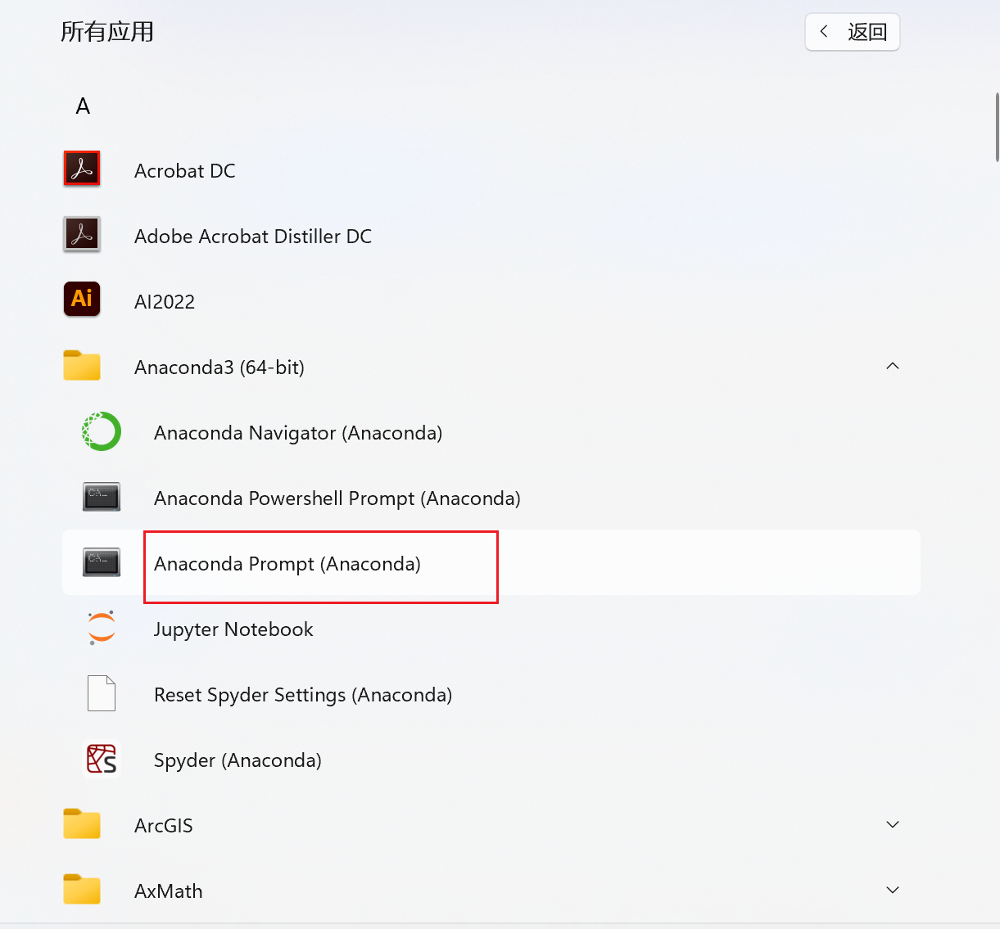

PS：均在 Anoconda 脚本使用


## 1.通过Anoconda管理多个python环境
```
1)查看环境目录
conda env list

2)查看所有环境  
conda info --envs  

3)创建环境:需指定python版本，否则相应环境中无.py文件
conda create -n py3.8  python=3.8

4)激活环境
conda activate py3.10  

5)退出环境
deactivate py3.10  

6)删除环境
conda remove -n py3.10 --all  

```

## 2.使用豆瓣源加速下载python包
```
#首先通过Anoconda进入相应的python环境
pip install lxml -i https://pypi.douban.com/simple/
pip install -i https://pypi.douban.com/simple lxml

#指定安装包版本
pip install -i https://pypi.douban.com/simple Keras==2.0.1
```


## 3.常用镜像网站
```
1)清华源
conda config --add channels https://pypi.tuna.tsinghua.edu.cn/simple/
conda config --set show_channel_urls yes

2)豆瓣源
conda config --add channels http://pypi.douban.com/simple/
conda config --set show_channel_urls yes

3)阿里云
conda config --add channels http://mirrors.aliyun.com/pypi/simple/ 
conda config --set show_channel_urls yes

4)中科大
conda config --add channels http://pypi.mirrors.ustc.edu.cn/simple/
conda config --set show_channel_urls yes

```


## 3.添加清华源下载eepforest包
```
conda config --add channels https://mirrors.tuna.tsinghua.edu.cn/anaconda/pkgs/free/

conda config --add channels https://mirrors.tuna.tsinghua.edu.cn/anaconda/pkgs/main/

conda config --add channels https://mirrors.tuna.tsinghua.edu.cn/anaconda/cloud/conda-forge/

conda config --add channels https://mirrors.tuna.tsinghua.edu.cn/anaconda/cloud/pytorch/

conda config --add channels https://mirrors.tuna.tsinghua.edu.cn/anaconda/pkgs/pro/

conda config --set show_channel_urls yes

conda install deepforest
```

## 4.恢复官方源
```
conda config --remove-key channels
```