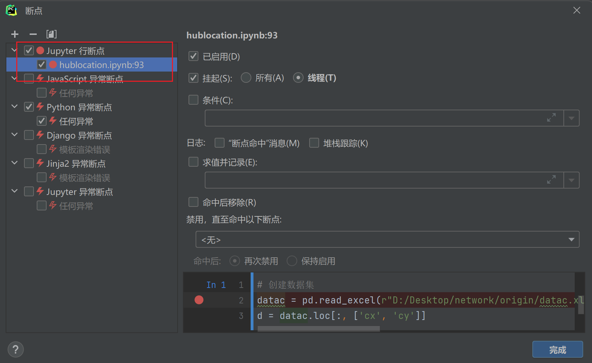

## 1.在Pycharm中内嵌jupter

1）新建并激活环境
```
conda create -n py3.6  python=3.6
conda activate py3.6
```
2）安装ipykernel库
```
pip install ipykernel
```
3）创建jupyter内核
```
Python -m ipykernel install --name py3.6_jupyter

#查看所有jupyter内核
jupyter kernelspec list

#删除不需要的内核
jupyter kernelspec remove py_jupyter
```

## 2.配置服务器地址
pycharm中新建jupyter文件，选择内核即可

## 3.在Pycharm中内嵌jupter
1）报错调试器连接失败
法1：删除项目文件夹中的idea

法2：取消断点，并重新选址


2）无法像单纯的pycharm一样执行调试功能
法1：在当前.ipynb文件的末尾单元格输入，将生成同名的.py文件
```python
try:
    !jupyter nbconvert --to python hublocation.ipynb
    # file_name.ipynb是当前模块的文件名
    # 转化完成后会生成file_name.py
except:
    pass
```