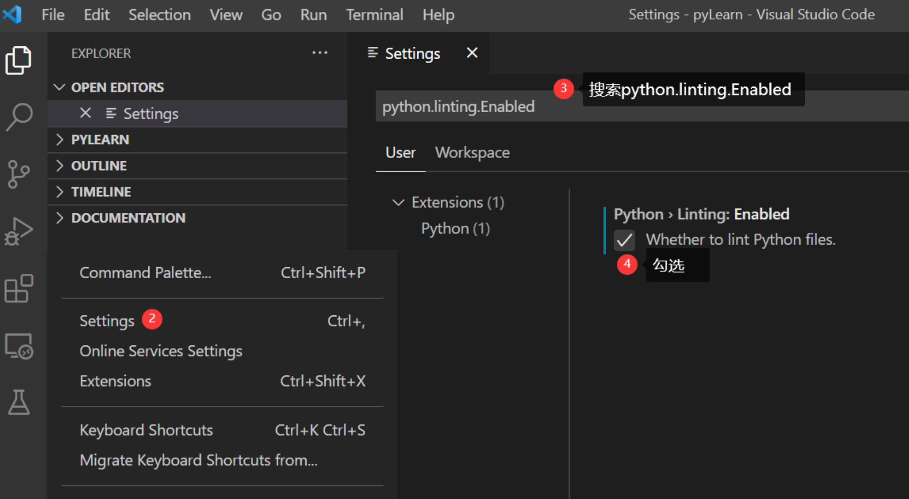
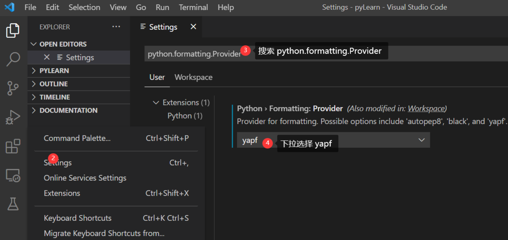
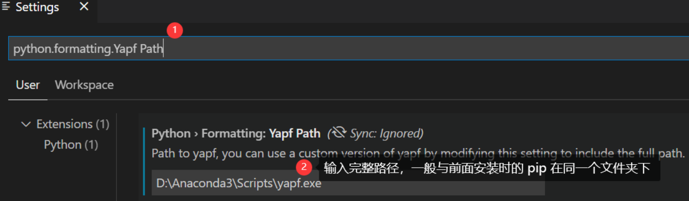
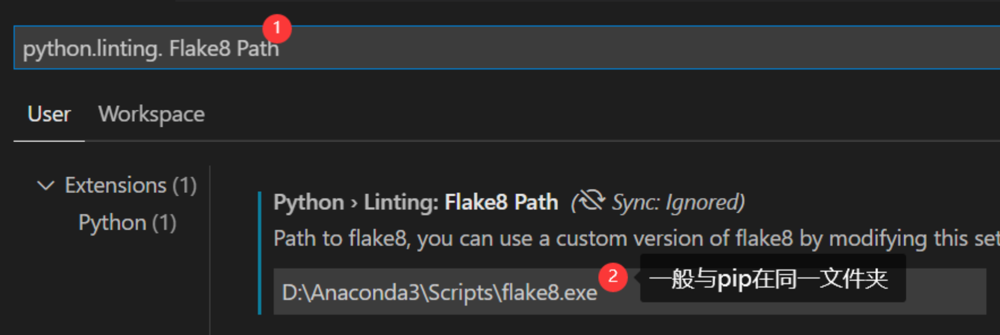
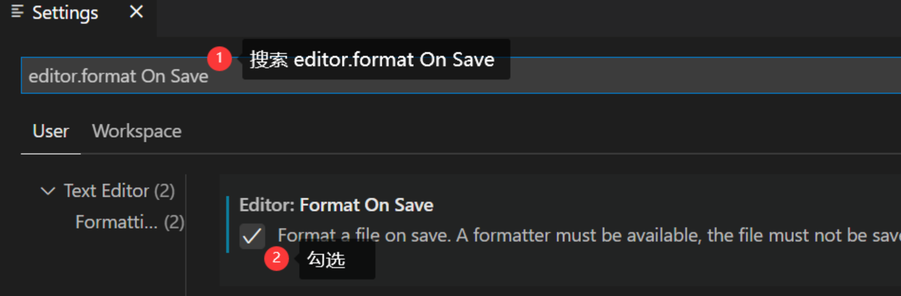

## 1.Vscode中运行python 
1）安装python 扩展

2）选择解释器：
   Ctrl + Shift +P , 调出命令面板
   输入 Python: Select Interpreter

3）代码规范：flake8 和 yapf
  flake8用来检查代码错误，yapf用来格式化代码 
  可以进入cmd 通过 pip 安装这两个模块

4）更改 Python扩展中的设置
  A:把 python.linting.Enabled 改为 True


  B:把 python.formatting.Providedr 设置为 yapf


  C:添加完整路径:



  D:配置为保存时自动格式化


PS:配置该选项后，每按CTRL + S 保存一次代码，它就会自动格式化一次；其它情况下可以选中后按 Shift + Alt+F 手动格式化

5）拼写检查：安装 Code Spell Checker 扩展
6）悬浮提示：安装 Sourcery 扩展


## 2.创建虚拟环境
Python 开发者的最佳实践是使用特定于项目的 virtual environment 。一旦激活该环境，安装的任何软件包都将与其他环境（包括全局解释器环境）隔离，从而减少软件包版本冲突

可以使用 Venv 或 Conda 和 Python 在 VS Code 中创建非全局环境：创建环境

1）打开命令面板，开始键入 Python: Create Environment 命令进行搜索

2）显示环境类型列表，Venv 或 Conda，选择 Conda

3）显示可用于项目的解释器列表，选择需要的解释器

4）选择解释器后，将显示一条通知，显示环境创建的进度

5）完成后，环境文件夹 ( /.conda ) 将出现在工作区中

## 3.py文件运行
1）单击编辑器右上角的 Run Python File in Terminal 运行按钮
2）右键单击编辑器窗口中的任意位置，然后选择 Run > Python File in Terminal（这会自动保存文件）
3） 选择一行或多行，然后按 Shift+Enter 或右键单击并选择 在 Python 终端中运行选择/行。该命令对于仅测试文件的一部分非常方便
4）从命令面板 (⇧⌘P) 中，选择 Python: Start REPL 命令为当前选择的 Python 解释器打开 REPL 终端。在 REPL 中，您可以一次输入并运行一行代码

## 4.程序文件调试
1）F9设置断点时，装订线中会出现一个红色圆圈
2）初始化调试器，请按 F5。

## 5.安装包
1）停止调试器并使用命令面板运行终端：创建新终端 (⌃⇧)
2）在打开的终端中通过 conda 命令安装相应的包：
```
conda install numpy
```