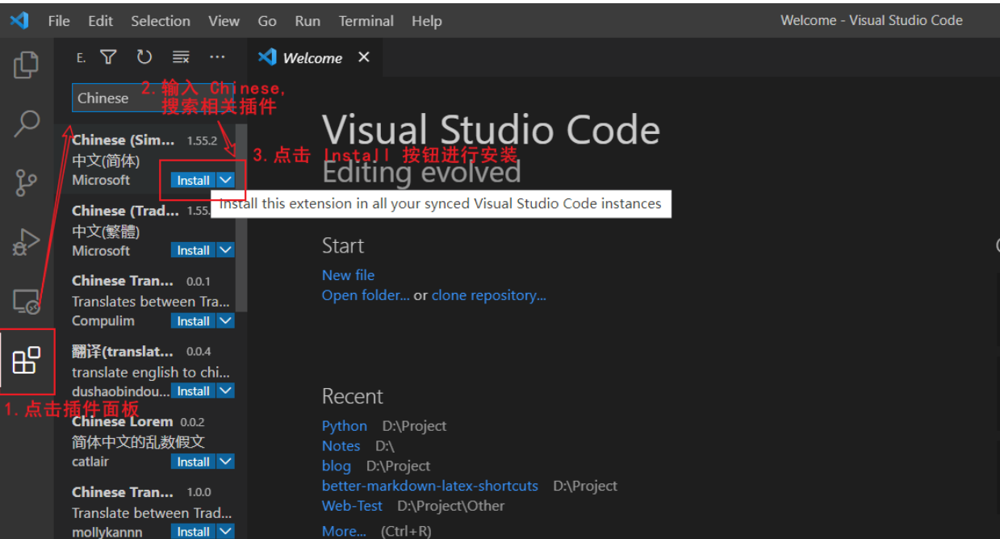
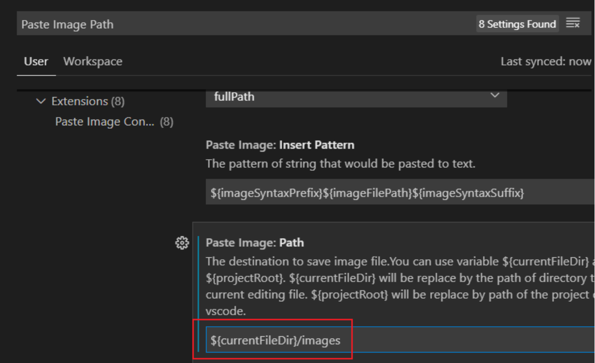
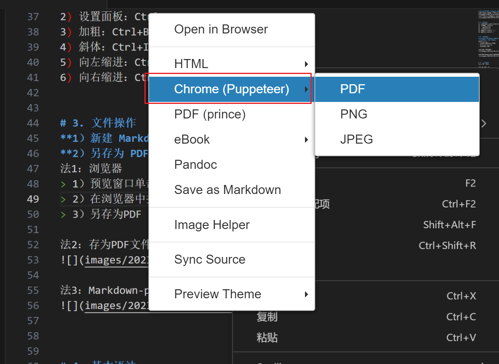
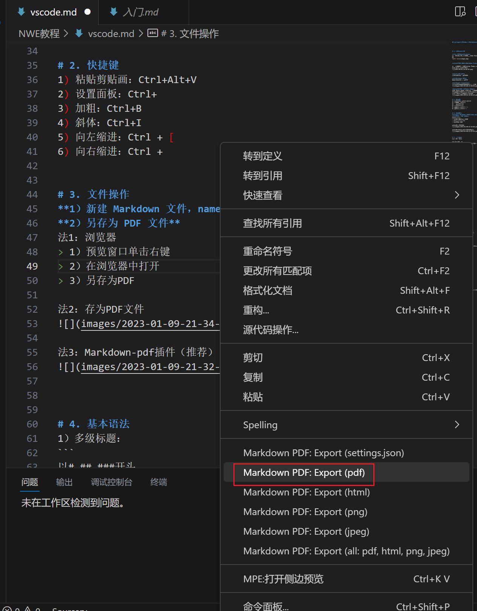

## 1. 安装相关插件

1）中文支持：Chinese
打开VSCode,点击插件面板,输入 Chinese,选择出现的第一个插件进行Install安装


2）修改预览窗口：Markdown Preview Enhanced

打开设置窗口,搜索Preview Theme,找到Preview Theme选项,在下拉框中选择atom-dark.css（暗色）


3）vscode-pdf
在VSCode内打开pdf文件

4）Markdown PDF
将markdown输出为pdf等

5）Google Translate
能够对VSCode可编辑的文本进行翻译


6）粘贴剪切画：Paste Image
安装 Paste Image 插件，打开设置窗口, 输入 Paste Image Path 并搜索, 将框内的文本改成 ${currentFileDir}/images，按下快捷键 Ctrl + Alt + V,就能把图片自动保存到当前目录下



## 2. 快捷键
1) 粘贴剪贴画：Ctrl+Alt+V
2) 设置面板：Ctrl+
3) 加粗：Ctrl+B
4) 斜体：Ctrl+I
5) 向左缩进：Ctrl + [
6) 向右缩进：Ctrl + 
   

## 3. 文件操作
1）新建 Markdown 文件，name.md；
2）另存为 PDF 文件
==法1：浏览器==
> 1）预览窗口单击右键
> 2）在浏览器中打开
> 3）另存为PDF

==法2：存为PDF文件==
右侧预览窗口，右键，选择


==法3： Markdown-pdf 插件（推荐）==
左侧编辑窗口，右键，选择Markdown-pdf



## 4. 基本语法
1）多级标题：
```python
以# ## ###开头
#与后接标题间要空一格
最多6级，7级等同于正文
```

2）分割线
```python
---
```

3）重点加粗
```python
**这是重点,需要加粗**
```

4）斜体
```python
*以斜体显示*
```

5）高亮
```python
==高亮文本==
```

6）删除线
```python
~~删掉本内容~~
```

7）段落
段落和段落之间要隔一行.

## 5. 列表
1）无序列表：* 
```python
* 列表1
  * 列表1.1
  * 列表1.2
  * 列表1.3
* 列表2
* 列表3
```

2）有序列表：1.
```python
1. 列表1
   1. 列表1.1
   2. 列表1.2
   3. 列表1.3
2. 列表2
3. 列表3
```

## 6. 引用文本
>此处为引用内容
>此处为引用内容
>此处为引用内容


## 7. 行内代码块
```python
print('hello,python')
```

显示代码行数:
```javascript {.line-numbers}
function add(x, y) {
  return x + y
}
```


## 8. 表格

| 表头 | 表头 |
| ---- | ---- |
| 内容 | 内容 |
| 内容 | 内容 |


## 9. 注释
```python
<!-- 你看不见我 -->

<!-- 多行注释
就像这样 -->

ps:注释不会被渲染出来
```

## 10. 任务列表
```python
- [x] 已经完成的事 1
- [x] 已经完成的事 2
- [x] 已经完成的事 3
- [ ] 仍未完成的事 4
- [ ] 仍未完成的事 5
```

