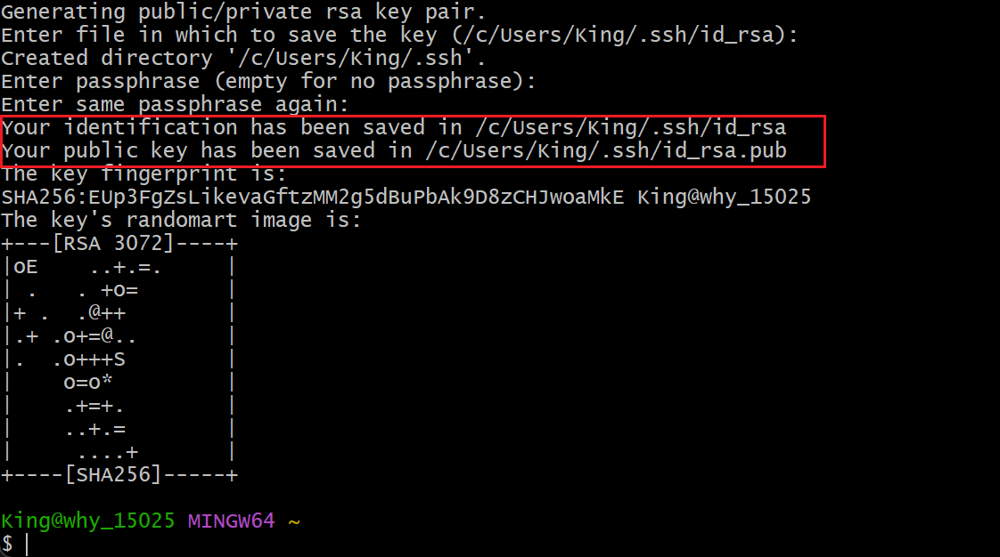
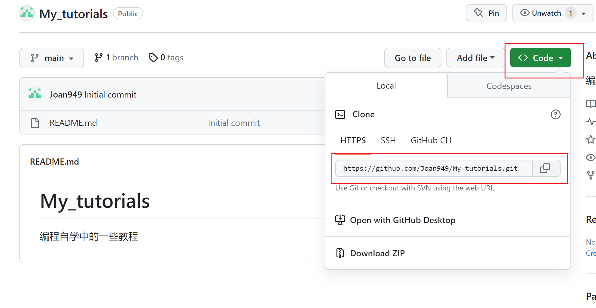
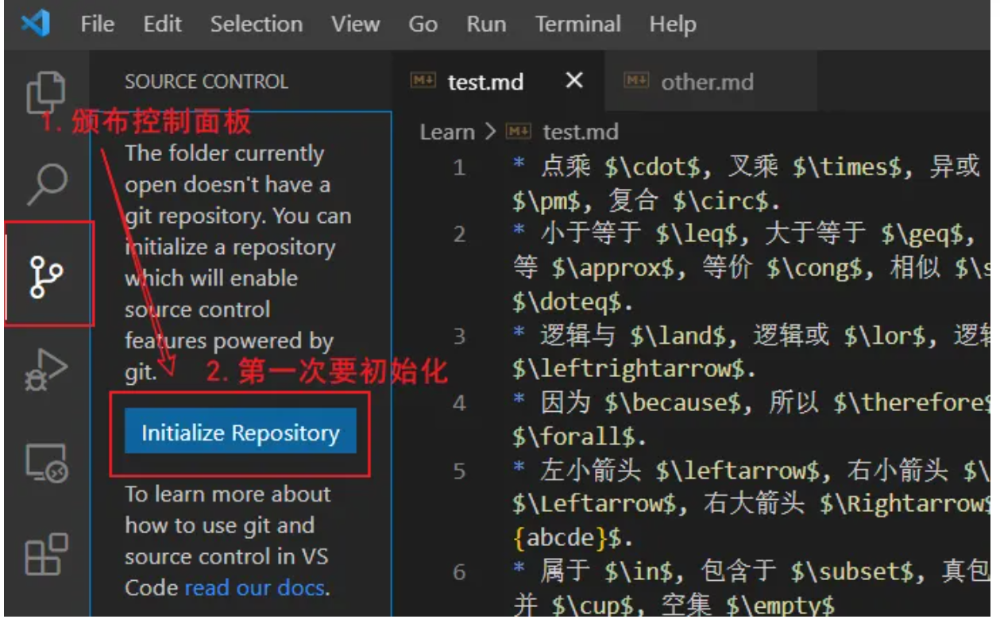
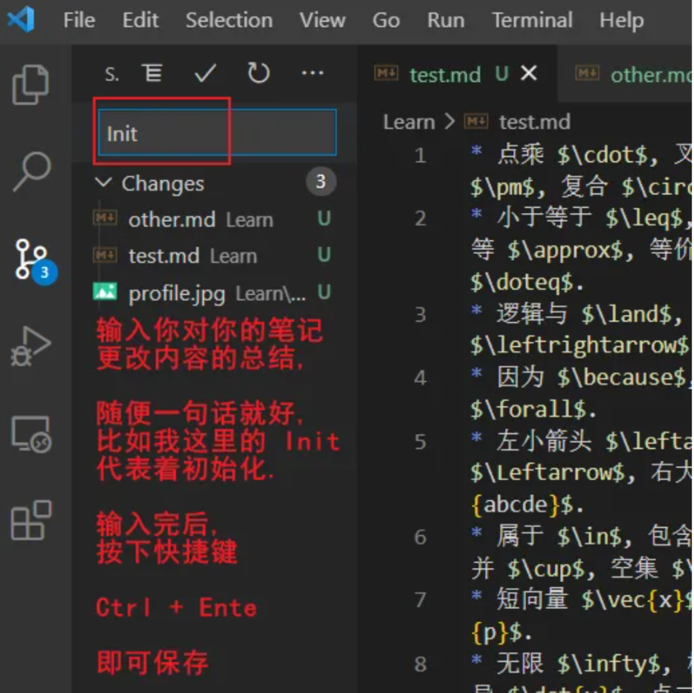
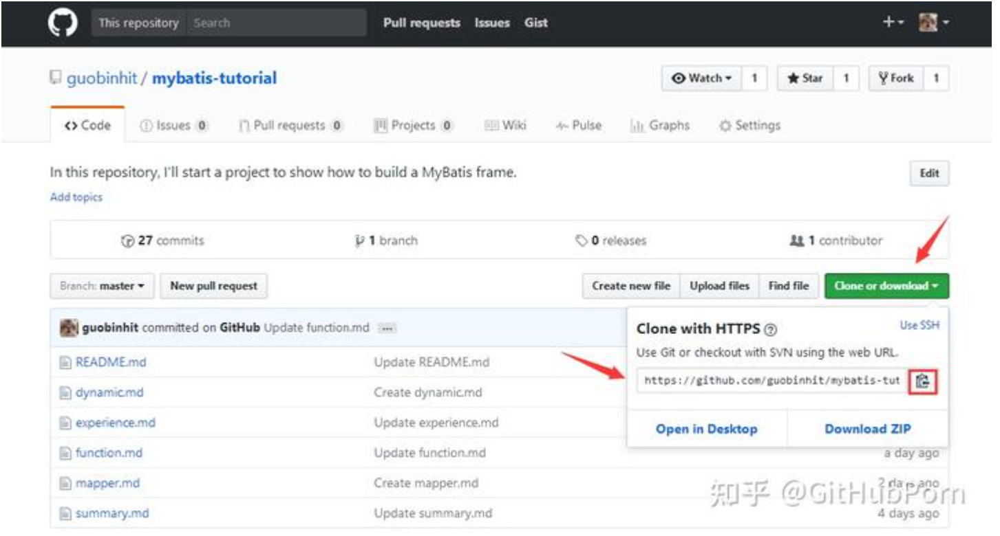
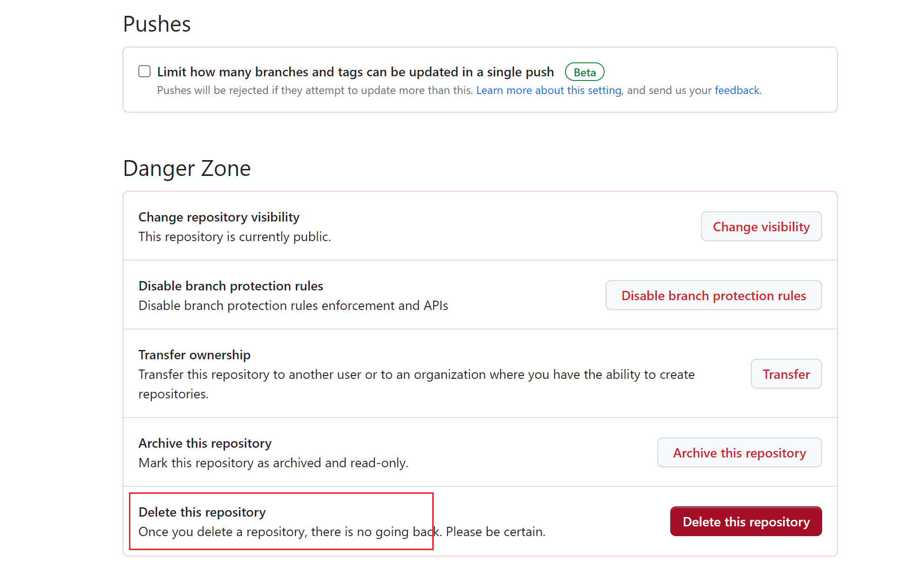
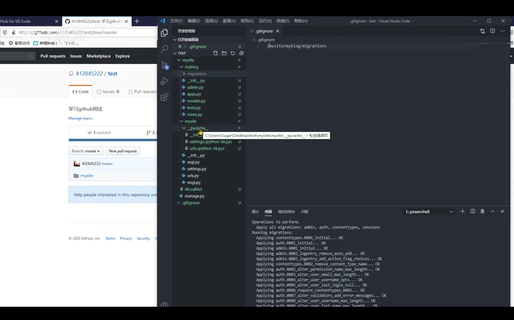

## 1. 两者的区别
1) git：版本控制软件；
2) github：开源网站

## 2. git客户端设置
1）安装git
安装完成后, 按下 Win 键, 输入 cmd, 回车，在命令行终端输入 git --version 命令，如果能够显示Git的版本号，则说明Git客户端已经成功安装.

安装完成后，在开始菜单里找到 Git->Git Bash，点击后出现一个类似命令行窗口的东西，就说明 Git 安装成功.

2）设置用户信息
```python
#设置
git config --global user.name "your_name" 
git config --global user.email "your_email" 

#修改
git config --global --replace-all user.name '用户名'
git config --global --replace-all user.email '邮箱'

#查看
git config --list
```


## 3. 常见的git命令
在我们进行任何的git操作之前，我们都得先切换到 Git 的仓库目录，点击鼠标右键，再选择Git Bash Here，即可打开 Git Bash 的命令行窗口.

1) 查看仓库状态
```
git status
```

2) 仓库初始化
```python
git init

#初始化后目录成为Git 仓库，并默认进入主分支
#Untracked fies提示仓库中有文件没有被追踪，hit.txt
#还提示使用git add命令操作这个文件
```

3）将hit.txt文件添加到 Git 仓库的缓存区
```python
git add hit.txt

#并没有把文件提交到 Git 仓库
#而是把文件添加到了「临时缓冲区」
```

4）将hit.txt文件提交到 Git 仓库
```python
git commit -m "text commit"
#双引号内为提交信息
```

5）打印 Git 仓库提交日志
```
git log
```

6）查看分支情况
```
git branch
#其中*号表示“当前所在的分支”
```

7）新建a分支
```
git branch a
```

8）切换到a分支
```
git checkout a
```

9）在当前分支创建并切换到b分支
```
git checkout -b b
```

10）将a分支合并到主分支
```
git merge a
#必须切换到master分支，才能使用
#在合并分支的时候，要考虑到两个分支是否有冲突
```
11）删除a分支
```
git branch -d a
```


12)当前所在分支添加了一个v1.0标签
```
git tag v1.0
#通过命令git checkout v1.0即可切换到该标签下的代码状态
```

## 4.利用 SSH 完成 Git 与 GitHub 的绑定
通过 Git 向 GitHub 提交代码时，不用反复验证账户信息
==1）在 Git Bash 中输入ssh命令，查看本机是否安装 SSH==
==2）指定 RSA 算法生成密钥，ssh-keygen -t rsa命令==
期间敲三次回车键，不需要输入密码
就会生成密钥id_rsa和公钥id_rsa.pub
并在当前界面查看文件目录：

==3）把公钥id_rsa.pub的内容添加到 GitHub==
进入Github的个人Settings页面
点击SSH and GPG Keys，然后点击New SSH key按钮
将公钥id_rsa.pub的内容粘贴到Key处的位置
点击Add SSH key 即可
==4）验证绑定是否成功
在 Git Bash 中输入ssh -T git@github.com进行测试：

## 5. 通过 git 将代码提交到 GitHub
1）进入该仓库，git init 初始化操作
2）存至暂存区，git add .
3）提交到本地仓库
```
git commit -m "说明信息"
```
4）获取远程仓库链接地址

5）关联远程仓库
```
#https协议
git remote add origin https://github.com/Joan949/My_tutorials.git

#ssh 协议
git remote add origin git@github.com:Joan949/My_tutorials.git

#重新链接远程仓库
git remote rm origin
git remote add origin https://github.com/Joan949/My_tutorials.git
```

6）先同步远程仓库和本地仓库
```
git pull origin main
```
7）再提交修改内容
```
git push origin main
```

## 6. 通过 git 实现VsCode版本控制
2）初始化--VsCode


3）版本保存--VsCode



## 7.克隆 github 项目到本地
1）新建存储文件夹GitRepo
2）获取地址链接
找到所需克隆的项目，点击Clone or download，复制地址链接

2）从存储文件夹目录进入 Git Bash
3）开始克隆，git clone 后为刚复制的链接地址
```
git clone https://github.com/guobinhit/mybatis-tutorial.git 
```

## 8.github仓库管理
1）仓库内新建文件夹：name+\
2）仓库内删除文件夹
github上只能删除仓库无法删除文件或文件夹
只能通过命令来解决：
```python
git pull origin master  # 将远程仓库里面的项目拉下来
 dir  # 查看有哪些文件夹
 git rm -r --cached picture  # 删除picture文件夹
 git commit -m "删除了picture文件夹"  # 提交,添加操作说明
 git push origin master  # 将本次更改更新到github项目上去
```
3）删除仓库
打开仓库主页面，点击设置，下滑至底部



## 9. 常见报错
1）refusing to merge unrelated histories
法1：在项目文件目录先克隆，在提交（更新操作）
法2：使用强制命令（不建议）
```
git pull origin master --allow-unrelated-historie
```

2）证书异常：fatal: unable to access
```python
#关闭证书校验
git config --global http.sslVerify "false"

#开启git证书校验
git config --global http.sslVerify "true"
```

1）新建 .gitignore文件
2）复制相对路径，反斜杠变正斜杠，加上该目录/
